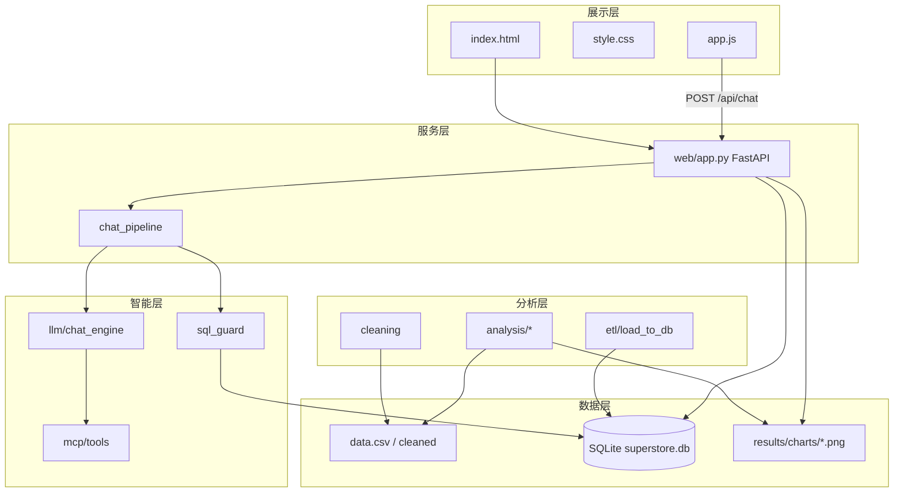
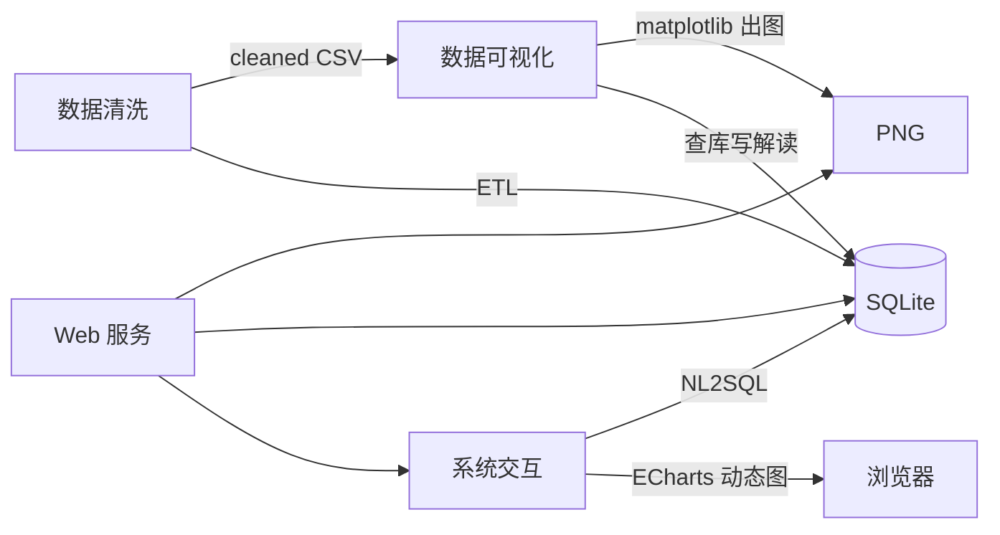
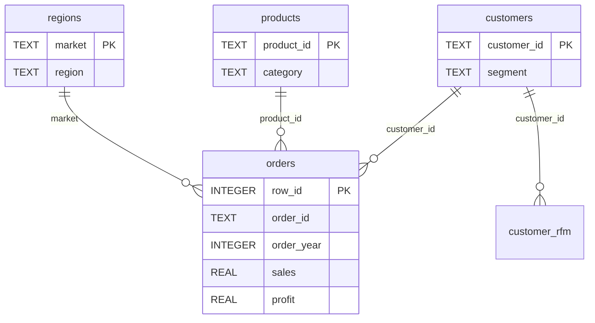
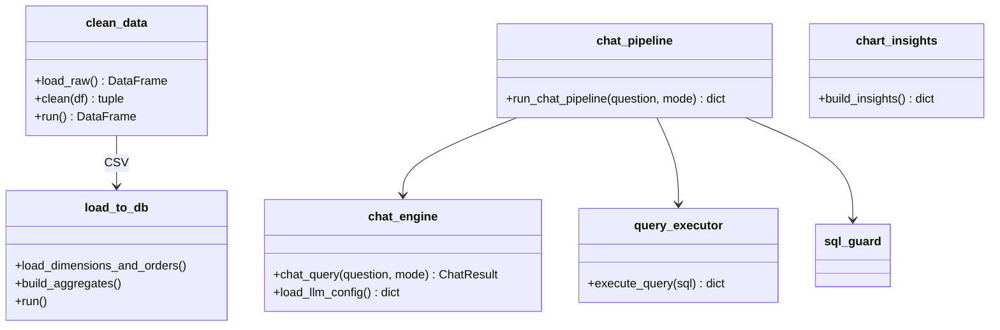

# 开发侧素材

## 一、项目简介

- **名称**：超市电商数据分析平台 v1.2
- **目标**：CSV 清洗 → 分析可视化 → SQLite 入库 → Web 展示 → NL2SQL 查询
- **技术栈**：Python 3.10+、pandas、matplotlib、FastAPI、SQLite、MCP、sklearn（客单价预测）
- **数据**：`data.csv`，约 51263 行，清洗后 **51240** 行（剔除 23 条）
- **流水线**：`clean_data` → `run_all`（含 forecast）→ `load_to_db` → `uvicorn web.app:app --port 8000`
- **仓库**：[https://github.com/moyu-mx/project](https://github.com/moyu-mx/project)

---

## 三大模块


| 模块    | 目录                              | 交付物                                           |
| ----- | ------------------------------- | --------------------------------------------- |
| 数据清洗  | `src/cleaning/` `src/etl/`      | 清洗 CSV、`cleaning_report.json`、`superstore.db` |
| 数据可视化 | `src/analysis/` `web/`          | **17 张** PNG、`forecast_report.json`、Web 仪表盘   |
| 系统交互  | `src/llm/` `src/mcp/` `src/db/` | NL2SQL（local/api）、MCP 工具、SQL 校验               |


**图表**：13 张描述分析 + 4 张预测（销售/客单价/淡旺季/区域，算法见 `forecast.py`）

**NL2SQL**：local = MCP schema + 正则规则（免 Key）；api = OpenAI 兼容 API + function calling

---

## 架构（设计用）

```
展示层 web/  →  服务层 FastAPI(chat_pipeline)  →  数据层 SQLite(src/db/)
分析层 src/analysis/、src/cleaning/  |  智能层 src/llm/、src/mcp/
```

- **库表**：维度 customers/products/regions + 事实 orders + 汇总 agg_*、customer_rfm（DDL：`sql/schema.sql`）
- **Web API**：`GET /`、`GET /charts/{name}`、`POST /api/chat`、`GET /api/chat/config`、`POST /api/chat/feedback`
- **MCP 工具**：`list_tables`、`get_database_schema`、`get_field_glossary`、`preview_table`、`validate_sql_query`
- **关键入口**：`clean_data.run()`、`run_all.main()`、`forecast.run()`、`chat_query()`、`build_insights()`

---

## 测试

```powershell
pytest tests/ -q
```


| 文件                        | 测什么               |
| ------------------------- | ----------------- |
| `test_lightbox.py`        | 17 图、首页结构         |
| `test_forecast.py`        | 4 预测图 + report    |
| `test_nl2sql.py`          | SQL 生成、ECharts 模板 |
| `test_sql_postprocess.py` | SQL 后处理           |

---

## 二、详细设计说明

离线批处理 + 在线 Web 服务：原始 CSV 经清洗/分析生成图表与 SQLite 库，FastAPI 提供页面展示与自然语言查询；NL2SQL 通过 MCP 获取 schema 语义后生成 SQL。

### 总体架构设计

**系统分层架构图**



**三大模块交互关系**



| 通信路径 | 方式 | 数据格式 |
|----------|------|----------|
| 清洗 → ETL | 文件 | UTF-8 CSV |
| 分析 → Web | 文件 | PNG + Jinja2 模板变量 |
| 前端 → 后端 | HTTP | JSON |
| chat_engine → DB | SQLAlchemy | SQL 结果集 |

### 分模块详细设计

**数据清洗模块**

**入口**：`src/cleaning/clean_data.py` → `run()` / `clean()`

**流程**：

```
load_raw(latin-1) → 删 Unnamed 列 → 删 Postal Code
→ 日期双格式解析 → 数值转型 → dropna(Sales/日期)
→ 派生 Order-year/month/quarter、Ship-year/month
→ 写 data/cleaned/*.csv + cleaning_report.json
```

---

**数据分析与预测模块**

**入口**：`src/analysis/run_all.py` → `main()`；预测可单独运行 `python -m src.analysis.forecast`

**流程**：

```
load_cleaned()（data/cleaned/*.csv）
→ 描述分析：profit → sales → regions → seasonality → customers → rfm → shipping
→ 各子模块 matplotlib 出图 → save_fig 写入 results/charts/*.png
→ forecast.run()：基于 2011—2014 原始订单做 2015 外推
→ 写 4 张预测图 + results/forecast_report.json
→ Web 侧 chart_insights.build_insights() 查库/读报告生成 17 图解读文案
```

**描述性分析**

| 子脚本 | 产出 PNG | 分析维度 |
|--------|----------|----------|
| `sales.py` | `sales_growth.png`、`avg_order_value.png` | 年度销售额、同比增长率、客单价 |
| `profit.py` | `profit_by_month.png` | 2011—2014 各年月度利润 |
| `seasonality.py` | `seasonality_sales.png` | 月度销售额淡旺季 |
| `shipping.py` | `shipping_cost_trend.png` | 发货成本月度趋势 |
| `regions.py` | `region_share.png`、`region_yearly_sales_top6.png` | 区域占比（<1% 合并「其他」）、前六区域年度销售 |
| `customers.py` | `new_old_customers.png`、`segment_share.png`、`segment_yearly_count.png`、`segment_yearly_sales.png`、`segment_category_sales.png` | 新老客户、客户类型占比/数量/销售额、类型×品类 |
| `rfm.py` | `rfm_distribution.png` | 2014 年 RFM 八类客户价值分布 |

**预测分析**

从描述图中选取具有明显时间趋势、适合外推的指标，展望 **2015** 年（虚线/绿色/金色为预测值）：

| 历史图 | 预测图 | 算法 | 数据粒度 |
|--------|--------|------|----------|
| 年度销售额与增长率 | `sales_forecast.png` | 48 个月度销售额一元线性回归，汇总全年 | 原始订单 |
| 年度客单价趋势 | `aov_forecast.png` | RF / GBR / Ridge 自动选型 + 月度递归 + 年度特征融合 | 48 月原始订单 + 年度聚合特征 |
| 月度销售额淡旺季 | `seasonality_forecast.png` | 线性趋势 + 季节指数 | 48 个月原始订单 |
| 前六区域年度销售额 | `region_forecast.png` | 各区域独立年度线性回归 | 区域×年原始订单 |

---

**系统交互模块**

**后端流程**：

```
POST /api/chat
  → chat_query(question, mode)     # local 正则 / api + MCP tools
  → validate_sql(sql)              # 仅 SELECT
  → execute_query(sql)             # SQLite
  → filter_rows + build_echarts_option
  → JSON 响应
```

**前端交互**（`web/static/app.js`）：

选择模式 local/api → 输入问题 → 提交 `/api/chat`

展示 SQL、summary、表格或 ECharts

可选反馈 → `POST /api/chat/feedback`

**local 模式**：`LOCAL_RULES` 正则匹配常见问题，调用 MCP 的 `get_database_schema` 等注入上下文。  
**api 模式**：OpenAI 兼容 API格式(实际用的deepseek的api)+ `OPENAI_TOOLS` function calling 多轮调用。

### 数据库详细设计

**E-R 关系**



**数据表一览**（完整 DDL：`sql/schema.sql`）

| 表名 | 主键 | 外键/说明 |
|------|------|-----------|
| `customers` | `customer_id` | segment/city/state/country |
| `products` | `product_id` | category, sub_category |
| `regions` | `market` | region（Market 即销售区域） |
| `orders` | `row_id` | FK→customers, products, regions；含 order_year/month/quarter, sales, profit, shipping_cost |
| `agg_sales_by_year` | `order_year` | 年度销售额、客单价、增长率 |
| `agg_sales_by_region_year` | `(market, order_year)` | 区域×年 |
| `agg_sales_by_month` | `(order_year, order_month)` | 月度销售 |
| `customer_rfm` | `(snapshot_year, customer_id)` | R/F/M 分值与 value_segment |
| `agg_segment_category` | `(segment, category)` | 客户类型×品类销售额 |

索引：`orders(order_year)`、`orders(customer_id)`、`orders(market)`。

### 接口详细设计

**HTTP 接口参数**

| 方法 | 路径 | 请求 | 响应 |
|------|------|------|------|
| GET | `/` | — | HTML（charts, stats, insights_json） |
| GET | `/charts/{name}` | path: 文件名 | PNG 文件 |
| GET | `/api/chat/config` | — | `{default_mode, api_enabled}` |
| POST | `/api/chat` | `{question, mode?, session_id?}` | 见下 |
| POST | `/api/chat/feedback` | `{query_id, correct}` | `{ok: true}` |
| GET | `/api/diagnose/{query_id}` | path: uuid | 查询日志记录 |

**`/api/chat` 响应核心字段**：

```json
{
  "query_id": "uuid",
  "sql": "SELECT ...",
  "mode": "local",
  "display": {"template": "bar|line|pie|table", "chart_title": "", "summary": ""},
  "columns": ["col1"],
  "rows": [[1]],
  "row_count": 1,
  "echarts_option": {},
  "elapsed_ms": 12
}
```

**MCP 工具（模块间 / LLM 调用）**

| 工具 | 入参 | 出参 |
|------|------|------|
| `list_tables` | — | 表名 + 中文说明 |
| `get_database_schema` | `table_name?` | Markdown 表结构 + 业务规则 |
| `get_field_glossary` | — | market/segment 等字段对照 |
| `preview_table` | `table_name`, `limit?` | 样本行 JSON |
| `validate_sql_query` | `sql` | 校验结果 + 错误信息 |

**调用链**：`chat_engine` → `dispatch_tool(name, args)` → 读 `schema_catalog` 或 `execute_query`。

### 关键类/函数设计

**模块关系（类图示意）**



**关键方法**

| 函数 | 入参 | 出参 | 功能 |
|------|------|------|------|
| `clean(df)` | DataFrame | `(df, report_dict)` | 清洗主逻辑 |
| `chat_query(q, mode)` | str, str | `ChatResult(sql, display, tools_used)` | 生成 SQL 与展示规格 |
| `run_chat_pipeline(q, mode)` | str, str | dict | 校验→执行→过滤→ECharts |
| `execute_query(sql)` | str | `{columns, rows, elapsed_ms}` | 只读 SQL 执行 |
| `validate_sql(sql)` | str | `(bool, msg)` | 禁止非 SELECT |
| `build_insights()` | — | `{png名: {title, analysis}}` | 17 图解读文案 |
| `forecast.run()` | — | report dict | 4 预测图 + JSON 报告 |

**核心数据类**：`ChatResult`（sql/mode/display/tools_used）、`QueryDisplaySpec`（template/x_column/y_column/summary）、`StructuredChatResponse`（API 模式 JSON 解析）。

